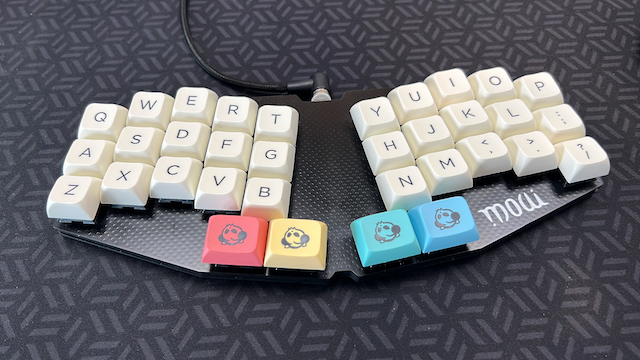
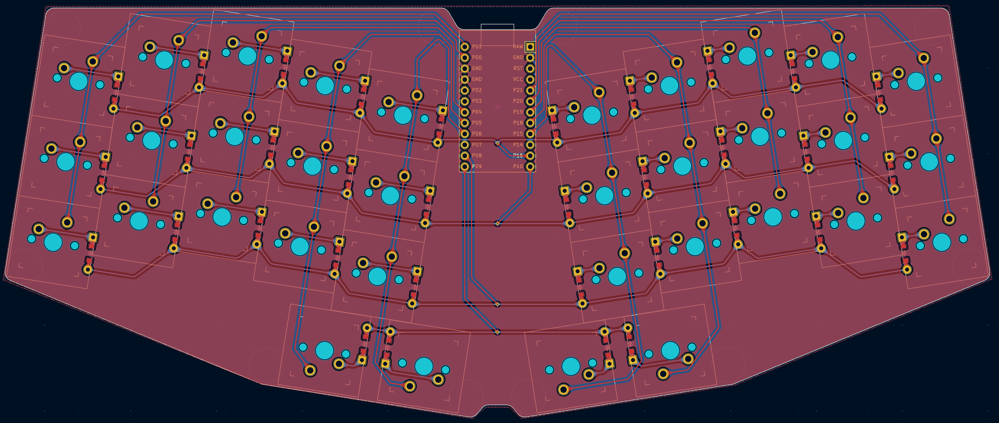

# moai Keyboard

A 34 key low(ish) profile keyboard with MX switches.

## About moai

The moai logo is an ambigram on the romanized japanese term "moai".

Moais (模合, Mo-ai) are social support groups that form in order to provide varying support from social, financial, health, or spiritual interests.

Moai means "meeting for a common purpose" in Japanese and originated from the social support groups in Okinawa, Japan.

The concept of Moais have gained contemporary attention due to the Blue Zone research popularized by Dan Buettner. According to research, Moais are considered one of the leading factors of the longevity of lifespan of the Okinawan people, making the region among the highest concentration of centenarians in the world.

Source: <https://en.wikipedia.org/wiki/Moai_(social_support_groups)>

## Design

It was designed using Ergogen and Kicad.

Original procedural design on [Ergogen](ergogen/moai.yaml) Folder and Kicad+Gerbers on [Build Files](build_files/)

## How to Build

(Under construction)
